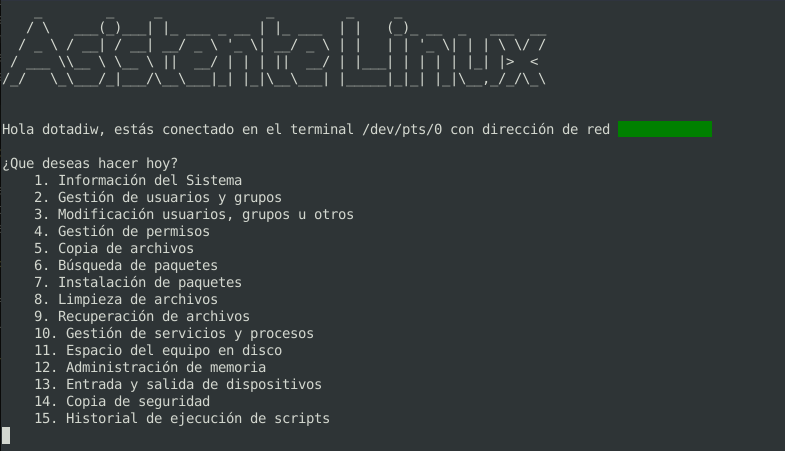

# Asistente Linux

El asistente Linux es una herramienta que pretende facilitar muchas 
de las instrucciones que son utilizadas a la hora de gestionar este 
sistema operativo. Las opciones van desde comandos simples como 
mostrar la hora, hasta otros bastante más complejos que resultan
largos y tediosos a la hora de ejecutarlos.

## Paquetes previos

Este asistente hace uso de algunos paquetes que por defecto
no están instalados en las distros por lo cual al momento de 
su ejecución por primera vez, estos serán instalados. 

 ### Paquetes a instalar:

- neofetch
- figlet

## Contenido

1. Información del Sistema
2. Gestión de usuarios y grupos
3. Modificación usuarios, grupos u otros
4. Gestión de permisos
5. Copia de archivos
6. Búsqueda de paquetes
7. Instalación de paquetes
8. Limpieza de archivos
9. Recuperación de archivos
10. Gestión de servicios y procesos
11. Espacio del equipo en disco
12. Administración de memoria
13. Entrada y salida de dispositivos
14. Copia de seguridad
15. Historial de ejecución de scripts
